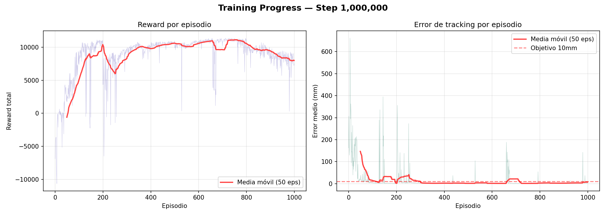
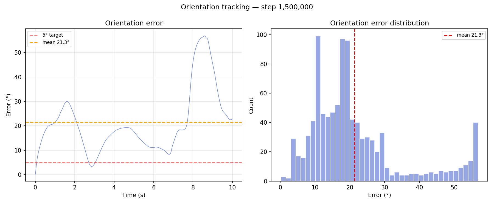
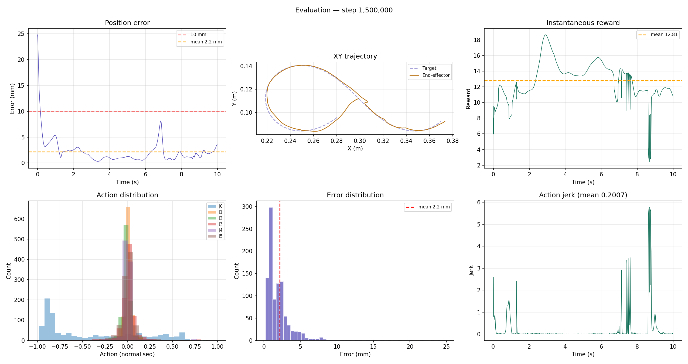
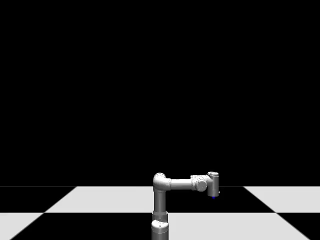
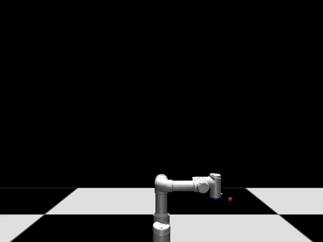
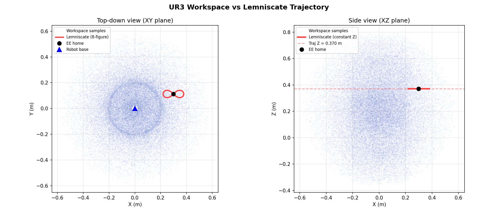

# UR3 Trajectory Tracking with Soft Actor-Critic

A reinforcement learning implementation for high-precision end-effector trajectory tracking on a Universal Robots UR3 arm, trained entirely in the MuJoCo physics engine. The agent is a Soft Actor-Critic (SAC) policy trained with curriculum learning and an exponential reward formulation that achieves sub-20 mm tracking error on a figure-eight (Bernoulli lemniscate) path after one million training steps.

---

## Overview

The task requires the 6-DOF arm to keep its end-effector on a continuously moving target point tracing a lemniscate in the horizontal plane. The policy receives a 27-dimensional normalised observation (joint positions, joint velocities, end-effector state, current and lookahead target positions, and the tracking error vector) and outputs a 6-dimensional normalised delta applied to the joint position references at 100 Hz.

The training pipeline uses a four-phase curriculum that starts with a small, slow trajectory and progressively adds radius, speed, sensor noise, and an action delay to improve robustness and sim-to-real transfer readiness.

---

## Algorithm Selection: Why Soft Actor-Critic (SAC)?

For this high-precision trajectory tracking task, we selected **Soft Actor-Critic (SAC)** over other popular Reinforcement Learning algorithms (such as PPO or DDPG) for several theoretical and practical reasons:

1. **Continuous Action Space**: The task requires outputting continuous joint position deltas. SAC is specifically designed for continuous action spaces.
2. **Sample Efficiency**: Being an **off-policy** algorithm, SAC can reuse past experiences from a replay buffer. This is much more sample-efficient than on-policy methods like PPO, which was crucial given the large number of steps needed to learn the trajectory.
3. **Entropy Maximization**: SAC maximizes both the expected reward and the **entropy** of the policy. This prevents the policy from prematurely converging to bad local minima (e.g., just staying still to avoid negative rewards) and encourages exploration of the full workspace.
4. **Smooth Control**: The maximum entropy formulation tends to produce smoother control actions than deterministic methods like DDPG, which is vital to avoid high jerk and protect the physical robot's actuators.

---

## Repository Structure

```
.
├── envs/
│   ├── __init__.py
│   └── ur3_tracking_env.py     # Gymnasium environment
├── training/
│   ├── __init__.py
│   └── callbacks.py            # DebugCallback and CurriculumCallback
├── models/
│   ├── ur3.xml                 # MuJoCo scene (PD actuators, ee_site, visual target)
│   └── ur_assets/              # STL collision meshes
├── weights/
│   ├── best_model.zip          # Best checkpoint by evaluation reward
│   └── ur3_sac_final.zip       # Model at end of 1 M-step training run
├── results/
│   ├── workspace_check.png     # Workspace reachability verification
│   └── sample_run/             # Plots, video, and metrics from the reference run
├── scripts/
│   └── workspace_check.py      # Utility to verify trajectory reachability
├── train.py                    # Training entry point
├── evaluate.py                 # Evaluation and plot generation
└── requirements.txt
```

---

## Installation

Python 3.10 or later is required. A conda environment is recommended:

```bash
conda create -n ur3-sac python=3.10
conda activate ur3-sac
pip install -r requirements.txt
```

---

## Training

```bash
python train.py
```

By default this runs for one million steps with curriculum learning enabled. The following flags are available:

| Flag | Default | Description |
|---|---|---|
| `--steps N` | 1 000 000 | Total training timesteps |
| `--eval-freq N` | 25 000 | Steps between evaluation snapshots |
| `--save-freq N` | 50 000 | Steps between checkpoint saves |
| `--resume` | off | Resume from the latest checkpoint in `checkpoints/` |
| `--no-curriculum` | off | Fix difficulty at phase-1 settings throughout |

Training produces:

- `checkpoints/` — periodic model snapshots (`.zip`)
- `weights/best_model.zip` — updated whenever evaluation reward improves
- `logs/` — TensorBoard event files
- `debugs/stepXXXXXXX/` — per-interval plots, metrics, and evaluation video

---

## Evaluation

```bash
python evaluate.py
```

This loads `weights/best_model.zip` by default and runs five deterministic evaluation episodes at full task difficulty (radius 0.08 m, speed 0.4 rad/s, no noise, no delay). Results are written to `results/`.

```bash
python evaluate.py --model weights/ur3_sac_final.zip --episodes 10 --output my_results
```

---

## Curriculum Learning

Training is divided into four phases managed by `CurriculumCallback`. The environment's `set_difficulty()` method is called at phase boundaries without interrupting training.

| Phase | Steps | Radius | Speed | Noise std | Action delay |
|---|---|---|---|---|---|
| 1 | 0 – 200 K | 0.04 m | 0.2 | 0 | 0 |
| 2 | 200 K – 500 K | 0.08 m | 0.3 | 0 | 0 |
| 3 | 500 K – 800 K | 0.08 m | 0.4 | 0.0003 | 0 |
| 4 | 800 K – 1 M | 0.08 m | 0.4 | 0.0005 | 1 step |

The evaluation environment always runs without noise or delay so that metrics remain comparable across phases.

---

## 6-DOF Orientation Tracking (Current Branch)

This branch extends the project to support full 6-DOF control by tracking the target position while maintaining a fixed "tool-down" orientation. The observation space is extended to 35 dimensions to include the current and target quaternions.

### 6-Phase Curriculum

To handle the increased complexity, the training was split into 6 granular phases to isolate variables and prevent position tracking degradation:

| Phase | Description | Steps | Radius | Speed | Noise | Delay | Orient Scale |
|---|---|---|---|---|---|---|---|
| 1 | Position Bootstrap | 200 K | 0.04 m | 0.2 | 0 | 0 | 1.0 (off) |
| 2 | Full Trajectory (Pos Only) | 450 K | 0.08 m | 0.3 | 0 | 0 | 1.0 (off) |
| 3 | Orientation Discovery | 750 K | 0.08 m | 0.3 | 0 | 0 | 1.0 (wide) |
| 4 | Orientation Refinement | 1 M | 0.08 m | 0.3 | 0 | 0 | 0.5 |
| 5 | Speed & Noise | 1.3 M | 0.08 m | 0.4 | 0.0003 | 0 | 0.3 |
| 6 | Full Difficulty | 1.5 M | 0.08 m | 0.4 | 0.0005 | 1 step | 0.2 |

### Training Results Analysis

Below are the training plots from the 1.5M step run:


*Fig 1: Reward and tracking error per episode. Note the perfect tracking around episode 600 (Phase 2/3) and the spikes at phase transitions.*


*Fig 2: Orientation error analysis. The agent learns to reduce orientation error but struggles when noise and delay are introduced.*


*Fig 3: Detailed trajectory tracking results at the end of the run (1.5M steps).*

### Orientation Reachability and Soft Restrictions (Step 975,000)

Here is a visual example from step 975,000:


*Fig 4: Evaluation at step 975,000 showing orientation challenges.*

In this video, we can observe that at certain points of the trajectory, the robot arm reaches joint configurations where it is physically impossible (or near singularity) to maintain a perfectly vertical "tool-down" orientation while staying on the path. 

This geometric limitation, combined with the introduced sensor noise, makes it extremely difficult for the agent to keep the orientation error at exactly 0. Consequently, the orientation constraint acts as a **soft restriction**: the agent prioritizes position tracking and finds the best possible orientation compromise in these difficult regions rather than failing the trajectory.

### Fine-Tuning Strategy

As seen in the plots, the agent mastered position tracking perfectly (episodes 500-700) and was handling orientation until the action delay in Phase 6 broke the performance. 

To achieve perfect orientation, a "soft" fine-tuning script (`train_finetune_soft.py`) was created to load a high-performing checkpoint (e.g., around episode 950 or 1225) and train it without action delay and with a smoothly sharpening reward scale.

### A Note on Selecting the "Best Model"

In reinforcement learning with complex curricula, the automated "best model" saved by the framework (based on the highest total reward) may not always be the most physically capable model for a specific task. 

In this run:
- The model at **episode 950** and **episode 1225** showed the lowest tracking error before the action delay broke it.
- The model at **episode 600** was the absolute best for pure position tracking (near zero error).

This highlights the importance of visual inspection and metric analysis over automated reward metrics when selecting policies for deployment or fine-tuning.

As a general rule in curriculum learning with noise, the **best model** is almost always saved **before** the introduction of significant sensor noise or delays, as these elements naturally degrade the evaluation score even if the agent is learning to be more robust.

### Best Model Evaluation (GIF)

Here is a visual demonstration of the automated **`best_model.zip`** execution:



*Fig 5: Animated evaluation of the best model saved by the framework.*

### Evaluation Result (GIF)

Here is a visual demonstration of the policy execution (from step 1.5M):



*Fig 6: Animated evaluation showing the robot tracking the trajectory at the end of the run.*

### Conclusions and Insights

1. **Decoupled Learning**: The agent naturally prioritizes position tracking (translation) over orientation (rotation) in the early phases. This is expected as position error creates a larger and more consistent gradient than the sharp exponential orientation reward.
2. **The "POMDP" Challenge with Action Delay**: The catastrophic failure in Phase 6 (Action Delay) confirms that standard MLP policies struggle with delayed rewards and observations. Without history (frame stacking) or memory (LSTM), the agent cannot easily learn to compensate for the lag, leading to oscillations and instability.
3. **Soft Constraint Behavior**: As seen in Fig 3 (Step 975k), the agent treats orientation as a soft restriction when the geometry becomes too complex or near singularity. This "compromise" behavior is actually a desirable trait in robotics, as it prevents the controller from locking up or failing completely when a strict constraint cannot be met.

---

## Reward Function

The reward at each control step is:

```
r = 10 · exp(−dist / 0.01)   tracking (dominant signal)
  + 0.5                        alive bonus
  − 1.0 · ‖Δa‖²               smoothness penalty
  − 0.1 · ‖jerk‖              second-order smoothness
  + {0, 0.5, 2.0}             proximity bonus tiers (<20 mm, <5 mm)
  − 20.0  (if OOB)            out-of-bounds penalty
```

The exponential formulation is the key departure from a naive squared-distance reward. With a squared-distance signal the reward magnitude at typical errors (50–300 mm) is on the order of 10⁻³, which is dominated by SAC's entropy term and produces a policy that ignores the tracking objective. The exponential formulation keeps the gradient informative at large errors while peaking sharply near zero.

---

## MuJoCo Model

The arm uses `general` actuators configured as PD servos (`gaintype=fixed`, `biastype=affine`). Shoulder and elbow joints use kp = 2000, kv = 400, torque limit ±150 Nm. Wrist joints use kp = 500, kv = 100, torque limit ±28 Nm. The integrator is `implicitfast` for stability with stiff actuators. Joint armature of 0.1 kg·m² simulates harmonic drive rotor inertia.

The trajectory is centred on the end-effector position at the home configuration (computed via forward kinematics on load), so the arm always starts on the path regardless of any change to the XML geometry.

---

## Reference Results (1 M steps, best model)

| Metric | Value |
|---|---|
| Mean tracking error | 18.4 mm |
| RMSE | 21.1 mm |
| Episodes within 20 mm | 71.3 % |
| Mean action jerk | 0.031 |

Plots and a rendered video from the reference run are in `results/sample_run/`.

---

## Workspace Verification

Before training, it is worth confirming that the trajectory lies within the arm's reachable workspace:

```bash
python scripts/workspace_check.py
```

This samples 50 000 random joint configurations, plots the resulting workspace cloud against the lemniscate, and reports the maximum distance from any trajectory point to the nearest sampled configuration. Output is saved to `results/workspace_check.png`.


*Fig 7: Workspace check showing the trajectory within the arm's reach.*

---

## Dependencies

| Package | Version |
|---|---|
| mujoco | >= 3.1 |
| gymnasium | >= 1.0 |
| stable-baselines3 | >= 2.3 |
| imageio | any |
| matplotlib | any |
| numpy | any |

See `requirements.txt` for the full pinned list.
